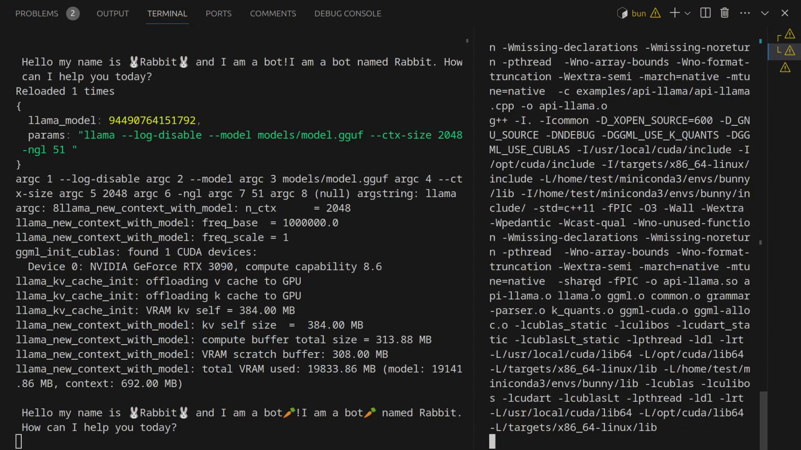

# bunny-llama


[demo video](https://www.youtube.com/watch?v=H9f7Np_zUzc)
## What is this?

A bunny that sits on top of a llama (and controls it).

### On a more serious note:

The bunny-llama project is a tool that uses [bun](https://bun.sh/) to interact with [llama.cpp](https://github.com/ggerganov/llama.cpp). It provides a way to **quickly develop and test code** using llama.cpp bindings. The project supports hot module reloading, which allows for changes in the code to be reflected in the running application **without needing to manually restart it.**

This also means **the model does not have to be reloaded** every time you make a change and **recompile your custom prompting functions**.
## Hot module reloading

under the hood in the llama.cpp dir:
``` bash
 make api-llama.so && curl localhost:1337
```

```bun make``` and ```bun make-cuda``` will take care of the curl already.

## To run:

``` bash
bun clone
bun make
bun ride
```

### To clean:

``` bash
bun clean
```

### To install bun:

``` bash
curl -fsSL https://bun.sh/install | bash
```

## Nvidia llama

For people with nvidia gpus:

install [conda.](https://docs.conda.io/projects/conda/en/latest/user-guide/install/linux.html)
``` bash
conda create -n bunny
conda activate bunny
conda install cuda -c nvidia
```


then make the llama with cuda, like so:

``` bash
bun clone
bun make-cuda
bun ride.ts
```

now you have a special cuda enabled llama.

if you closed your shell and you want to build the cuda llama again,
you need to activate the conda environment first:
``` bash
conda activate bunny
bun make-cuda
```